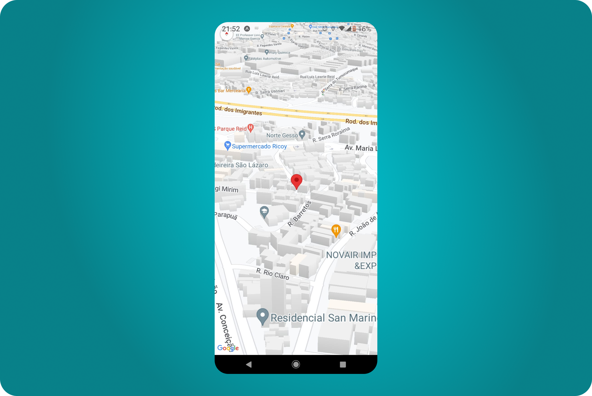

# Projeto de Mapas com React Native

Este projeto é uma aplicação móvel que utiliza React Native para criar uma interface de mapas interativos, permitindo visualizar localizações, adicionar marcadores e explorar funcionalidades de geolocalização em dispositivos iOS e Android.



---

## Descrição

Este projeto demonstra como integrar mapas em um aplicativo React Native usando a biblioteca `react-native-maps` (ou outra API de mapas, como Google Maps). A aplicação exibe um mapa funcional com a possibilidade de adicionar marcadores personalizados, rastrear a localização do usuário e interagir com o mapa por meio de gestos como zoom.

## Funcionalidades

- Exibição de mapas interativos.
- Adição de marcadores em coordenadas específicas.
- Suporte à geolocalização para exibir a posição atual do usuário.
- Compatibilidade com iOS e Android.

## Instalação

Siga os passos abaixo para configurar o projeto localmente:

1. **Clone o repositório:**

   ```bash
   git clone https://github.com/matheusfdosan/react-native-map.git
   cd react-native-map
   npm install
   ```

2. **Instale as dependências:**

   ```bash
   yarn install
   # ou
   npm install
   ```

3. **Inicie o Metro Bundler:**
   ```bash
   npx expo start
   ```

## Uso

- Ao iniciar o aplicativo, você verá um mapa centralizado em uma localização padrão (ex.: coordenadas definidas no código).
- Use gestos para navegar pelo mapa (pinch para zoom, arrastar para mover).
- Clique em um botão (se implementado) ou interaja com a interface para adicionar marcadores ou ativar a geolocalização.

Exemplo de código básico para exibir o mapa:

```jsx
import MapView from "react-native-maps"

export default function App() {
  return (
    <MapView
      style={{ flex: 1 }}
      initialRegion={{
        latitude: -23.5505,
        longitude: -46.6333,
        latitudeDelta: 0.0922,
        longitudeDelta: 0.0421,
      }}
    />
  )
}
```

## Licença

Este projeto está licenciado sob a [MIT License](LICENSE).

## Agradecimentos

- Inspirado em tutoriais como o vídeo [Projeto de Mapas com React Native](https://www.youtube.com/watch?v=7DY1tHHudtM).
